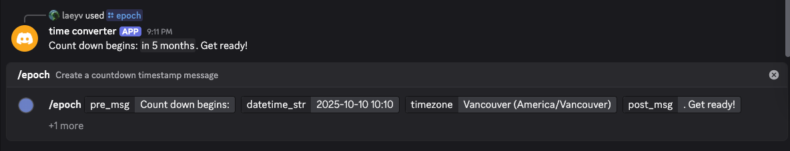

# Discord Epoch Bot

A simple Discord bot that converts a datetime string into epoch seconds and formats a countdown.

[Bot invitation link](https://discord.com/oauth2/authorize?client_id=1371199566749237492&permissions=274877908992&integration_type=0&scope=bot+applications.commands)

## Usage
```slash
/epoch pre_msg:Count down begins: datetime_str:2025-10-10 10:10 timezone:Vancouver (America/Vancouver) post_msg:. Get ready!
```
Note: format is optional, default value is Relative (in 420 days)
